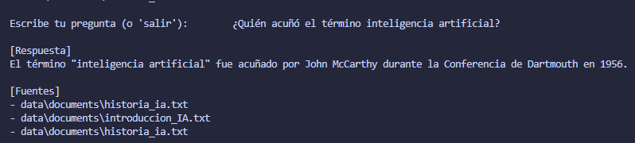

# RAG LangChain OpenAI del proyecto

```
rag_langchain_openai/
│
├── src/
│   ├── vectorstore.py        
│   ├── splitter.py           
│   ├── loader.py             
│   ├── rag_agent.py          
│
├── config/
│   └── config.py             
│
├── app.py                    
├── ingest.py                 
├── .env                      
└── README.md                 
```
## ⚙️ Configuración inicial

Tener un entorno virtual activo y ejecutar:
```
pip install -r requirements.txt
```

Paquetes principales:

- langchain

- langchain_openai

- langchain_pinecone

- langchain_text_splitters

- pinecone-client

- python-dotenv

## 🔑 Configurar claves en ```.env```
```
OPENAI_API_KEY=tu_api_key_de_openai
PINECONE_API_KEY=tu_api_key_de_pinecone
PINECONE_ENVIRONMENT=us-east-1
PINECONE_INDEX_NAME=rag-index
```

## 🧩 Explicación de los módulos
### 🧠 1. Conexión con Pinecone + OpenAI Embeddings

Esto se puede ver en el módulo vectorstore.py, en este módulo se usa OpenAIEmbeddings con el modelo text-embedding-3-small para generar representaciones vectoriales de texto.
Se conecta a Pinecone mediante su SDK y se crea un índice serverless si no existe. Devuelve un PineconeVectorStore que LangChain utiliza para almacenar y buscar los embeddings.


## ✂️ 2. División de documentos

Esto se puede ver en splitter.py, en este módulo se usa RecursiveCharacterTextSplitter para dividir los textos en chunks manejables.

Parámetros configurables desde config.py:

- CHUNK_SIZE: tamaño de cada fragmento.

- CHUNK_OVERLAP: número de caracteres de solapamiento.

Esto es importante porque los modelos de lenguaje trabajan mejor con fragmentos más pequeños de texto.

## 📚 3. Carga de documentos
Esto se puede ver en loader.py, donde se utiliza DirectoryLoader y TextLoader para leer automáticamente todos los archivos .txt en una carpeta.

Devuelve una lista de Document de LangChain, lista para procesarse.

## 🔍 4. Creación del Agente RAG
Esto se puede ver en rag_agent.py creando un agente que combina recuperación de contexto + generación de respuesta:

Recupera los documentos más relevantes de Pinecone.

Genera respuestas con ChatOpenAI (gpt-4o-mini).

Usa RetrievalQA.from_chain_type de LangChain para unir el retriever (buscador) y el LLM (modelo generador).


## 💾 5. Variables globales
Esto se puede ver en config.py, donde se entralizan todas las configuraciones del proyecto:

Claves de OpenAI y Pinecone.

Parámetros de chunking.

Cantidad de resultados (TOP_K) recuperados en cada consulta.

## 💬 6. Interfaz CLI (Consola)
Se puede ver en app.py, este nos permite hacer preguntas en consola:

```
python app.py
```

El usuario escribe una pregunta y el agente RAG busca en la base vectorial la información relevante y responde.

También muestra las fuentes de donde provino la respuesta.

## 📥 7. Proceso de Ingesta
Se encuentra en ingest.py, el cual es un script que:

Carga los documentos con loader.py.

Los divide con splitter.py.

Los convierte en embeddings.

Los sube al índice de Pinecone.

Se ejecuta una sola vez (o cada vez que se agregan documentos nuevos):

```
python ingest.py
```

## 🚀 Ejecución completa
1. Ingestar los documentos
```
python ingest.py
```

2. Ejecutar el agente y hacer preguntas:
```
python app.py
```

3. Ejemplo de uso
```
🚀 Bienvenido al RAG con LangChain + Pinecone + OpenAI
Escribe tu pregunta (o 'salir'): ¿Quién acuñó el término inteligencia artificial?

[Respuesta]
John McCarthy acuñó el término "inteligencia artificial" en 1956 durante la Conferencia de Dartmouth.

[Fuentes]
- data/ia_historia.txt
```
# Prueba del funcionamiento

- Prueba de que funciona la ingesta de datos

- Prueba de que funciona las preguntas según la información ingestada


🧩 Tecnologías principales

- LangChain – Framework de orquestación de LLMs.

- OpenAI API – Modelos de lenguaje (gpt-4o-mini, text-embedding-3-small).

- Pinecone – Almacenamiento y recuperación vectorial.

- Python – Implementación del flujo completo RAG.